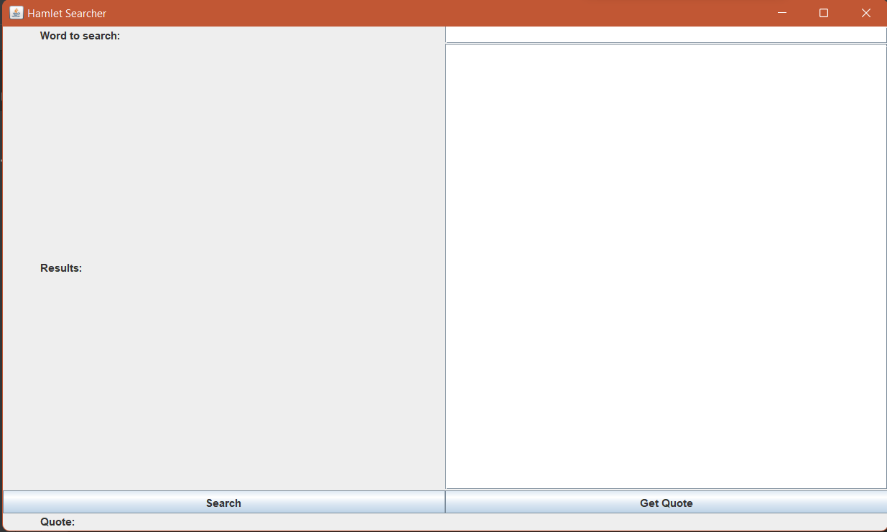
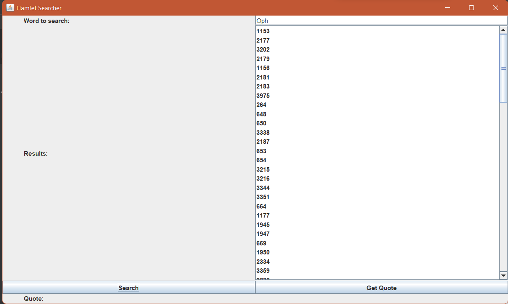
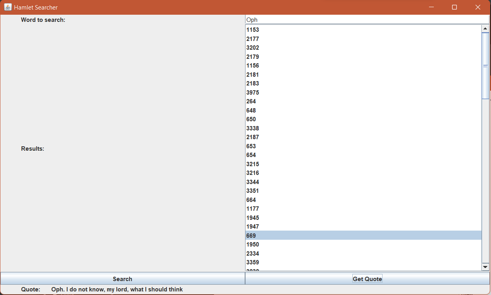

# Word Searcher

This codebase contains the server and GUI that search through a text file (containing hamlet). The client makes a request to the server that retrieves all the lines where the imputed text is contained. The server then sends the results back to the client. The client can then retrieve the full line by selecting a line number.

